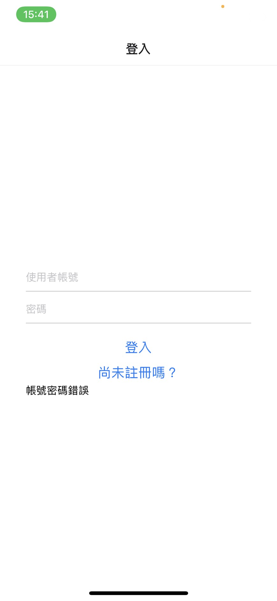
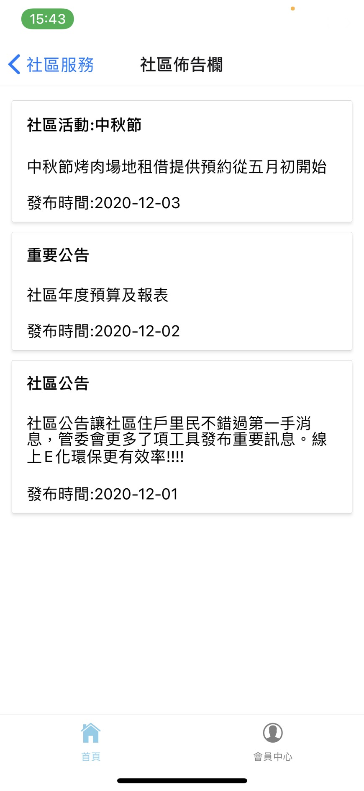
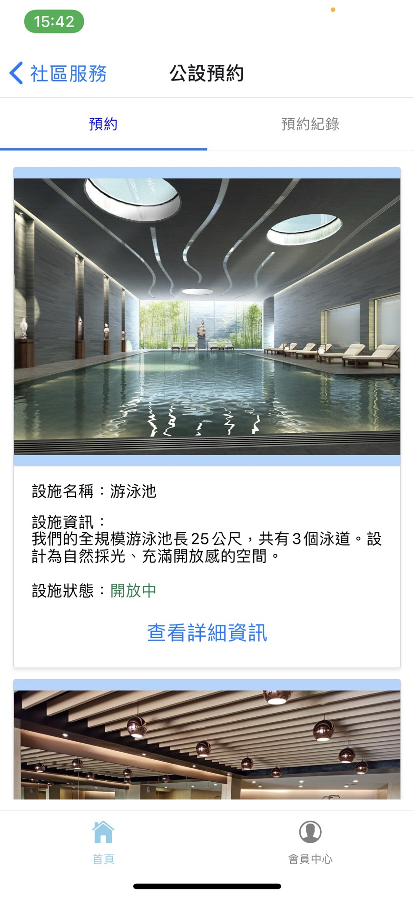
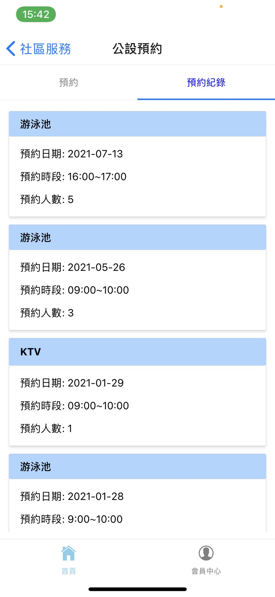
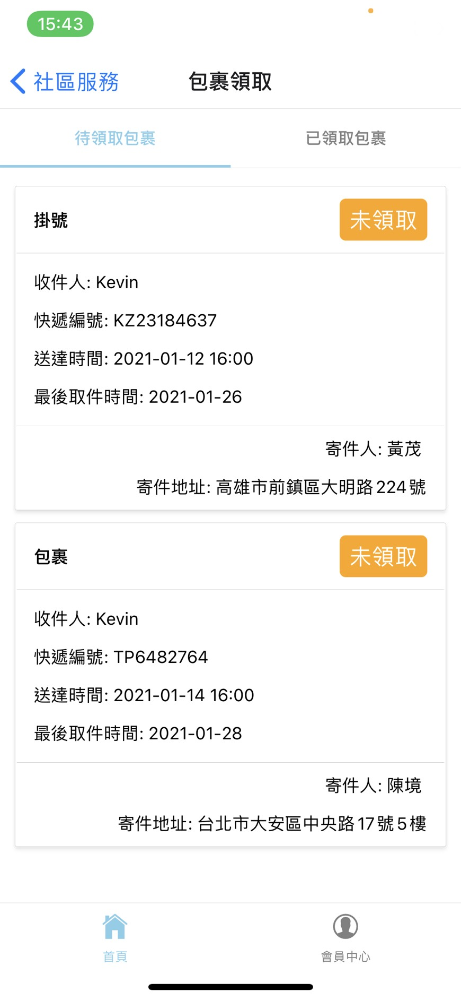
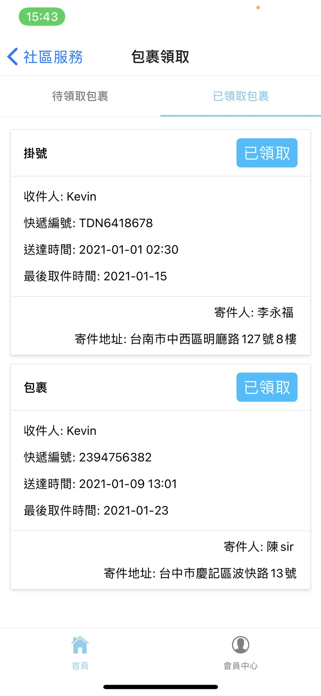
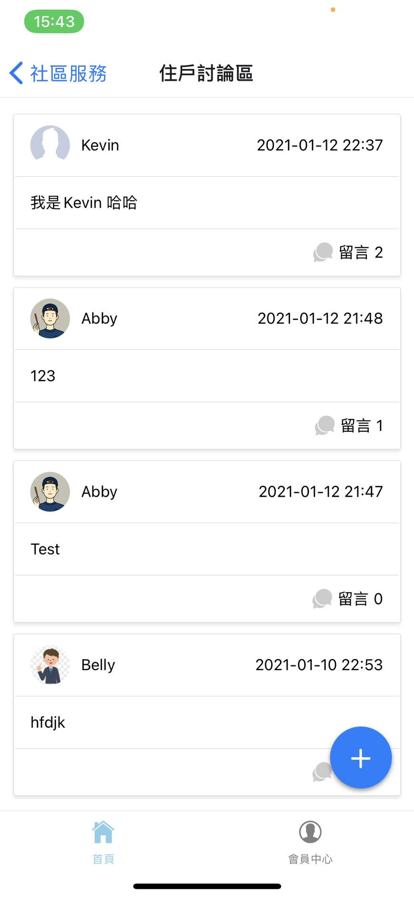
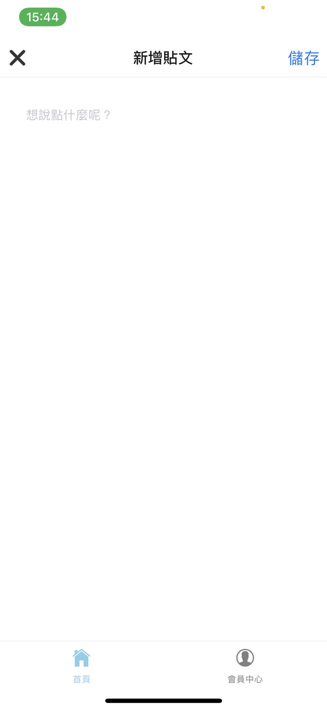
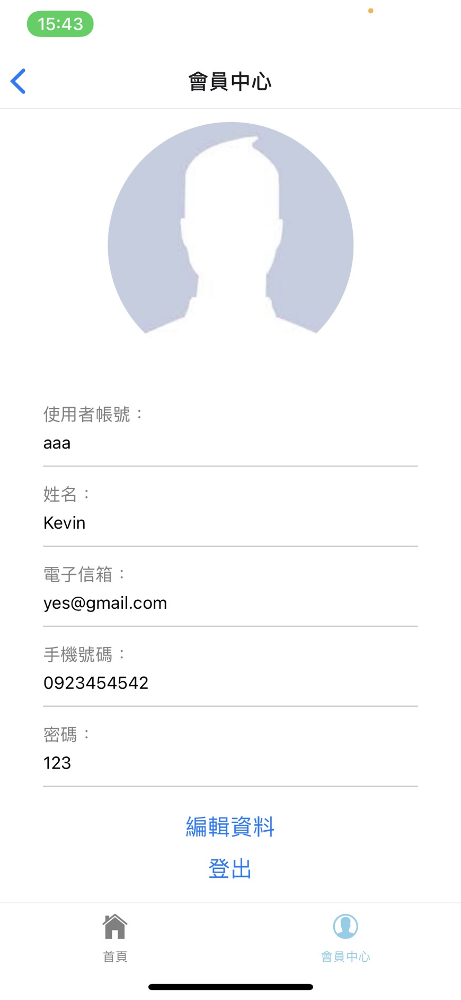
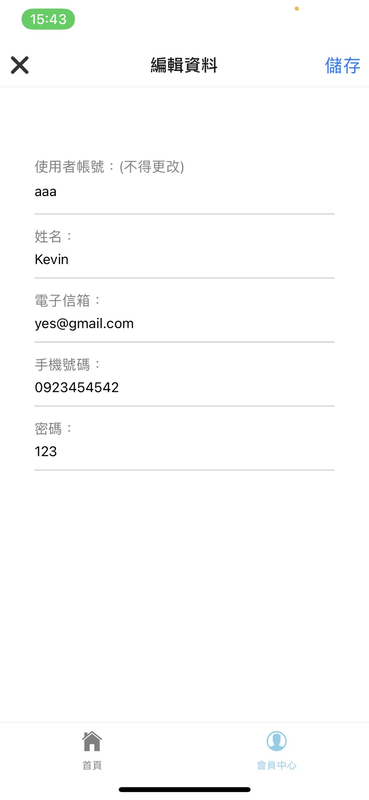

# 社區管理系統 (客戶端) Community Manage System (User)

本專案為建立社區系統，能夠將傳統需要紙本流程、電話/簡訊、實體公告等方式以APP來達成，住戶可以輕鬆的在手機上使用社區各項服務，管委會也能透過APP更有效率的維繫社區日常業務

使用ReactNative開發搭配雲端RDBMS資料庫管理

## 功能

* 社區公告
* 公設預約服務
* 掛號/包裹通知
* 住戶討論區/留言板
* 個人資料維護

## 介面

住戶登入頁面

登入首頁

社區公告(佈告欄)頁面

公設清單頁面

公設預約頁面

包裹收取頁面 (尚未領取)

包裹收取頁面 (已領取)

住戶討論區頁面

住戶討論區 (新增留言) 頁面

個人資料頁面

個人資料維護頁面

